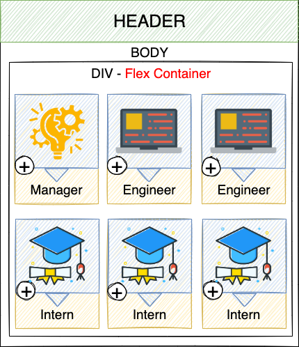
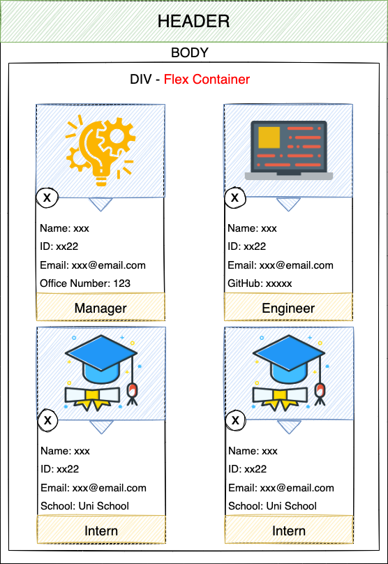
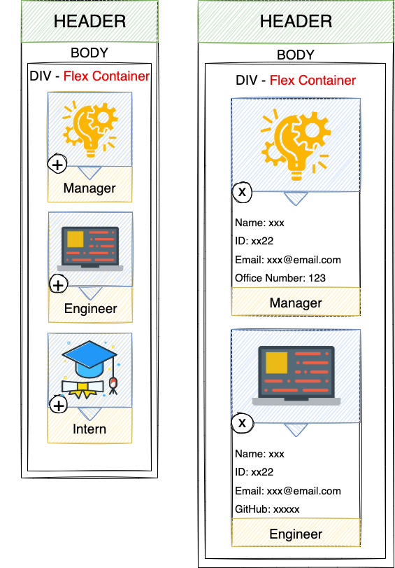
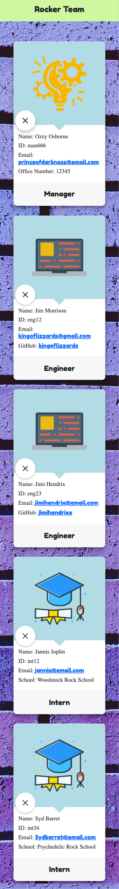

<h1>Team Profile Generator</h1>

<h2>Table of Contents</h2>

- [Description](#description)
- [User Story](#user-story)
- [Technologies Used](#technologies-used)
- [Installation](#installation)
- [Usage](#usage)
- [Test](#test)
- [Screenshots](#screenshots)
  - [Wireframes](#wireframes)
  - [Final Website](#final-website)
- [Video Walkthrough](#video-walkthrough)
- [Questions](#questions)

## Description

Team Profile Generator is a Node.js command-line application that takes in information about employees on a software engineering team, then generates an flat and responsive HTML webpage that displays summaries for each person.

## User Story

```md
GIVEN a command-line application that accepts user input
WHEN I am prompted for my team members and their information
THEN an HTML file is generated that displays a nicely formatted team roster based on user input
WHEN I click on an email address in the HTML
THEN my default email program opens and populates the TO field of the email with the address
WHEN I click on the GitHub username
THEN that GitHub profile opens in a new tab
WHEN I start the application
THEN I am prompted to enter the team manager’s name, employee ID, email address, and office number
WHEN I enter the team manager’s name, employee ID, email address, and office number
THEN I am presented with a menu with the option to add an engineer or an intern or to finish building my team
WHEN I select the engineer option
THEN I am prompted to enter the engineer’s name, ID, email, and GitHub username, and I am taken back to the menu
WHEN I select the intern option
THEN I am prompted to enter the intern’s name, ID, email, and school, and I am taken back to the menu
WHEN I decide to finish building my team
THEN I exit the application, and the HTML is generated
```

## Technologies Used

#### Languages

- HTML5
- CSS
- JavaScript
- JQuery

#### Frameworks used

- Bootstrap CSS Framework
- Google Fonts CDN

#### Packages used

- Node.Js
- Inquirer
- Jest
- @types/jest

## Installation

To install the application follow the steps below:

```
npm install
```

## Usage

To use the application follow the steps below:

```
npm run start
```

## Test

To use the application follow the steps below:

```
npm run test
```

## Screenshots

### Wireframes

#### Large viewport Wireframe

 


#### Small viewport Wireframe



### Final Website

#### Large viewport Website


#### Small viewport Website




## Video Walkthrough

Click [here](https://drive.google.com/file/d/15LaAN_dBrrKa6AAhzCkfbqMINoFp7Lha/view?usp=sharing) to access the Video Walkthrough.

## Questions

If you have any question or suggestion, please fell free to get in touch with me by:

Email: [luizfroes@gmail.com](mailto:luizfroes@gmail.com)

GitHub: [luizfroes](https://github.com/luizfroes)
